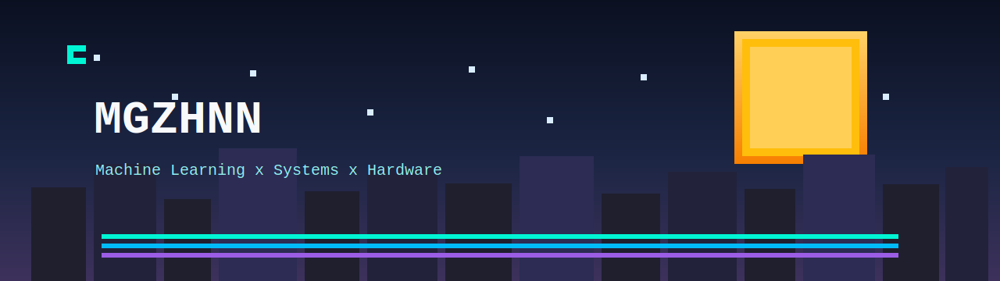

  

<h1 align="center">Magzhan Ziyabek</h1>

  <code>System Architecture</code>
  <code>C/C++ Engineering</code>
  <code>Applied AI</code>
  <code>Digital Logic</code>
  <code>Embedded Thinking</code>

  
  

## Current Focus
- Diffusion-based anomaly detection for medical imaging
- Real-world deep learning experiments with PyTorch
- Digital logic design and verification with VHDL
- System design and architecture using C/C++

## Tech Stack

  
  
  
  
  
  
  

## Featured Projects
| Project | Description |
| --- | --- |
| [THOR_DDPM_IDRiD](https://github.com/Mgzhnn/THOR_DDPM_IDRiD) | IDRiD-focused adaptation of THOR_DDPM for diffusion-based retinal anomaly detection. |
| [it-ml](https://github.com/Mgzhnn/it-ml) | Chapter-by-chapter practice notebooks based on hands-on ML material. |
| [OOP-Project---ATM-Machine](https://github.com/Mgzhnn/OOP-Project---ATM-Machine) | Console ATM simulation in C++ with multi-bank, bilingual flow, and transaction history features. |
